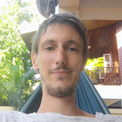
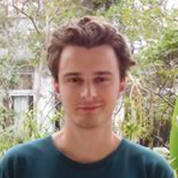
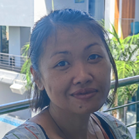
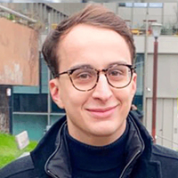

# 🎨 Creative Team

## Jeremy Douchamps

👋 Founder — [🇹🇭 ](https://emojipedia.org/flag-thailand/)Phuket — [Twitter](https://twitter.com/GokaiLabs) — [Discord](https://discordapp.com/users/Jeremy%20|%20Gokai%20Labs#0633) — [Linkedin](https://www.linkedin.com/in/jeremy-douchamps/)&#x20;

Jeremy is the founder. He has almost 20 years of web design and conception experience and has been exploring the world of cryptos and its protocols since 2017.

This know-how led him to choose the Elrond network for the future growth of the business and to launch a web3 project around a collection of NFTs.

Deeply involved in the world of web3, decentralisation and the community of DAOs, he has worked for Snapshot.org for over two years.


He has worked for more than a year of collaboration with the biggest builders in the Elrond network.


## Louis Lanne

👋 Artist — [🇫🇷](https://emojipedia.org/flag-france/)Paris — [Twitter](https://twitter.com/Lanne\_L) — [Discord](https://https/discord.com/users/LouisLanne#2568) — [Instagram](https://www.instagram.com/louislanne/)

Louis is a traditional artist with an [awesome backstory](https://www.unfanzineparmois.com/ici\_yann/louis-lanne-compost/). (Interview in French).

You can follow his work on Instagram, but he is not often active on Twitter or Discord.

New in the world of blockchain and NFTs. He accepted the challenge of designing Pixel Art layers for NFT.

He gave us one of the rarer works in his career! We're sure he'll keep giving us more. We are hoping to see his own work in NFTs soon.


He was awarded the Angoulême Young Talent Prize in 2019. He is currently studying in the art school at Beaux Art de Paris.


## Nati Douchamps

👋 Marketing director — [🇹🇭 ](https://emojipedia.org/flag-thailand/)Phuket — [Twitter](https://twitter.com/OSymbolique) — [Discord](https://discord.com/users/OrangeSymbolique#8860) — [Linkedin](https://www.linkedin.com/in/nati-douchamps-1151a8144/)

Nati is the marketing director. She was involved with the collection's design and was responsible for naming many NFT layers. She also designs marketing campaigns for social networks.

## Albert Lanne

👋 Expert SEO — [🇫🇷](https://emojipedia.org/flag-france/)Paris — [Discord](https://discord.com/users/.Albert.blend#0289) — [Linkedin](https://www.linkedin.com/in/albertlanne/) — [Website](https://albertlanne.com/)

Albert is an SEO expert. He is full of great suggestions for making sure we’re ranking high on Google. He is gearing up for a long-term SEO campaign.

#### We would not exist without our friends, family, members and advisors!


We also include dozens of people that have helped, advised and supported us during the progress of this project. **Nick**, **Vladimir**, **Dan**, **Troy**, **Julian**, **Horatiu**, **Damian**, **Alex**, **Barbara**, **Fabien**, **Mickael**, **Yacin**, **Thip**, **Jessica**, **Valentin**, **Sergiu**, **Flo**, **Sanji**, **Nali**. And so many others in the community. Thank you all ❤️

