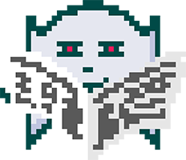
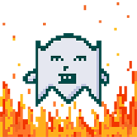
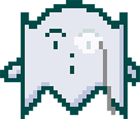
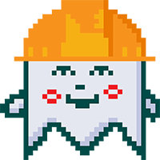

# 🌴 Gokai Labs

Gokai Labs, a creative web agency based in Thailand for the past 10 years, is passionate about web3 and the Elrond blockchain. This year, we’re launching a fun NFT collection dedicated to the Elrond community and network.

## Why make NFTs on Elrond?

### **It's just a matter of time!**

Designing websites and marketing campaigns for our clients is our core business, but this work is ephemeral, responding to a specific need at a particular time.

As creators, we had to build something that would last in our name for many years. It's how an exciting human adventure started by passionate and creative people began.

### We knew we needed a mascot, so we created one!

At the same time, Elrond Network deserves an atypical character.

The Mr Ghost has been with us for as long as we can remember! He's immortal, or almost... Some say you can burn him.

It's in this challenging situation that Mr Ghost was born.

We designed Mr Ghost with the Maiar logo in mind because this is the place it will haunt forever. We made the Maiar Ghosts collection beautiful because you will see it for eternity.

### Collecting and trading are the ultimate utility!

A metaverse NFT could have some great utility. Sure! But what will become of the collection if the metaverse does not explode or function?

We designed our collections to please both **digital art lovers** and **collectors**. It's the essence of NFT and gets overlooked by tech teams competing for a utility.

Creating an original, immortal character with a story to tell and by public artists are far better long-term guarantees than any metaverse project.

### It belongs to the community!

Since day one, we've had a super supportive community. We have a Discord Ambitious Organization that is building the project with the decision-making process.

The members recently voted to add the Maiar Ghosts to the Play2Earn application of our partner Effort Economy.

Members decide how often and at what price we deliver our supplies. They also set out how the organization distribute and uses its wallet.


**We are confident that working together, we can make Mr Ghost popular in the Elrond community culture!**

