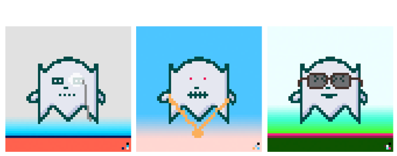

# 👻 Maiar Ghosts

Maiar Ghosts is an 8658 unique Mr Ghost NFT collection on the Elrond blockchain. 

That collection was born from a wish to create an NFT around the M logo from the Elrond Network ​​digital wallet: **Maiar**.

## Rarity

Maiar Ghosts are made up of 9 groups of attributes.

* 75 **backgrounds**
* 39 **clouds**
* 99 **decorations**
* 8 **bodies**
* 265 **expressions**
* 78 **tools**
* 61 **hats**
* 23 **jewels**
* 18 **transports**

For a total of 666 different traits! Each one is more degenerate than the next...


The rarity has been configured with a ratio based on the Fibonacci sequence. The larger the ratio of appearances, the less rare the elements.


### **Bodies** 

* **Mr Ghost** **-** ratio 377
* **Maiar** - ratio 21
* **Mrs Ghost** - ratio 13
* **Gnome** - ratio 8
* **Druid** - ratio 5
* **Dwarf** - ratio 3
* **Troll** - ratio 2
* **Invisible** - ratio 1


Almost every trait has a tiny colour signature in the lower right-hand corner. The combination creates a unique signature for each NFT.


### **Expressions**

The expression on a ghost's face can tell you how they're feeling with their signature!

* **White signature -** positive
* **Grey signature -** neutral
*   **Black signature -** negative

* **All** - ratio 1


Over 200 **projects** are hidden in these traits. Some projects have died, but Mr Ghost is still alive!

Also, there are all of Maiar's **stickers** here.

The 4 **elements**, but also planets, dogs, babies and much more


### **Backgrounds** 

* **Projects** - ratio 1
* **Stickers** - ratio 2

### **Clouds** 

* **All** - ratio 1

### **Decorations** 

* **Projects** - ratio 3
* **Elements** - ratio 2
* **Mars** and **Moon** - ratio 1

### **Tools** 

* **Objects** - ratio 3
* **Dogs** and **babies** - ratio 2
* **Maiar** - ratio 1

### **Hats** 

* **All** - ratio 3
* **Stickers** - ratio 2 
* **Elements** - ratio 1

### **Jewels** 

* **Projects** - ratio 3
* **Stickers** - ratio 2
* **Mex** and **eGold** - ratio 1

### **Transports** 

* **All** - ratio 2
* **Witch's broom** - ratio 1

###  Layer-grouping combinations


There are 10 different layer combinations, each with 666 NFTs, and one is 1998.


* **Background**, **Body** and **Expression** - 666 NFTs
* **Background**, **Decoration**, **Body** and **Expression** - 1998 NFTs
* **Background**, **Cloud**, **Decoration**, **Body** and **Expression** - 666 NFTs
* **Background**, **Decoration**, **Body**, **Expression** and **Tool** - 666 NFTs
* **Background**, **Decoration**, **Body**, **Expression** and **Hat** - 666 NFTs
* **Background**, **Cloud**, **Decoration**, **Body**, **Expression** and **Tool** - 666 NFTs
* **Background**, **Cloud**, **Decoration**, **Body**, **Expression** and **Hat** - 666 NFTs
* **Background**, **Decoration**, **Body**, **Expression**, **Hat** and **Tool** - 666 NFTs
* **Background**, **Cloud**, **Decoration**, **Body**, **Expression**, **Hat** and **Tool** - 666 NFTs
* **Background**, **Cloud**, **Decoration**, **Body**, **Expression**, **Jewel**, **Hat** and **Tool** - 666 NFTs
* **Background**, **Cloud**, **Decoration**, **Body**, **Expression**, **Transport**, **Jewel**, **Hat** and **Tool** - 666 NFTs


**If you're an Elrond fan, then this is the NFT for you!**

