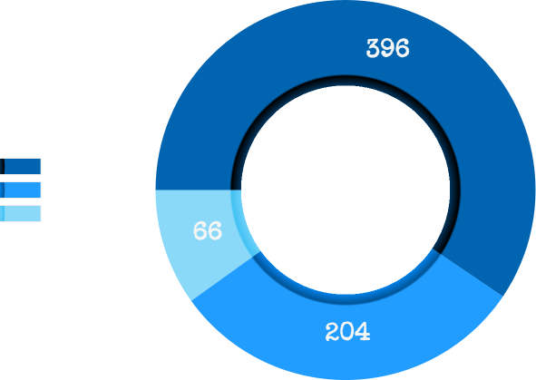
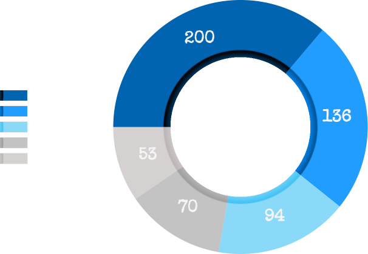
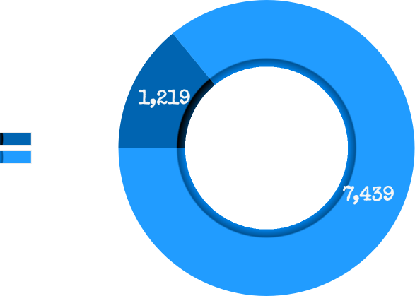

# 📈 Tokenomics

## Supply distribution


There are 13 drops, each with 666 NFTs in it for a total of 8658 NFTs. Drop 1 is sold out and drop 2 is in progress.


### Drop 1

* **Launch Date**: <mark style="color:green;"></mark> <mark style="color:yellow;">Friday 13 May 2022</mark>
* **Mint Price:** <mark style="color:yellow;">0.0666 EGLD</mark> **-** 4.30$
* **Earned income:** <mark style="color:yellow;">13.6 EGLDs -</mark> 891.30$

### Drop 2

* **Launch Date**: <mark style="color:yellow;">Friday 30 July 2022</mark>
* **Mint Price:** <mark style="color:yellow;">0.1 EGLD</mark> - 6.55$
* **Earned income:** <mark style="color:yellow;">21.5 EGLDs</mark> - 1409.00$


There are 11 planned drops, which will be distributed progressively by members’ votes.


## Statistics

* **Total Volume:** <mark style="color:yellow;">41 EGLDs</mark>
* **Total holders:** <mark style="color:yellow;">515</mark>
* **Total Mint:** <mark style="color:yellow;">36.6 EGLDs</mark> - 2399.10$


14% of all supply has already been minted.


## Project going&#x20;

Initial contributions from the foundation are 100 EGLDs and 30 M LKMEXs.


For every EGLD or LKMEX, **100%** is staked.


* **100%** of the mint goes to stake in EGLD.
* **100%** of the royalties go to stake in EGLD.
* **100%** of the EGLD staking rewards go to stake in EGLD.
* **100%** of the LKMEX staking rewards go to stake in LKMEX.

## Wallet

* **Staked EGLD:** <mark style="color:yellow;">125 EGLDs</mark> - 8300$
* **Staked LKMEX:** <mark style="color:yellow;">30M LKMEXs</mark> - 2000$

### Monthly income&#x20;

* **EGLD staking rewards:** <mark style="color:yellow;">1 EGLD</mark> - 65$
* **LKMEX staking rewards:** <mark style="color:yellow;">1M LKMEXs</mark> - 65$


View Main Wallet



A part of liquidity allows the foundation to meet the team's financial needs to reach these goals. For example launchpad participation, investment, trading and floor price buying.

